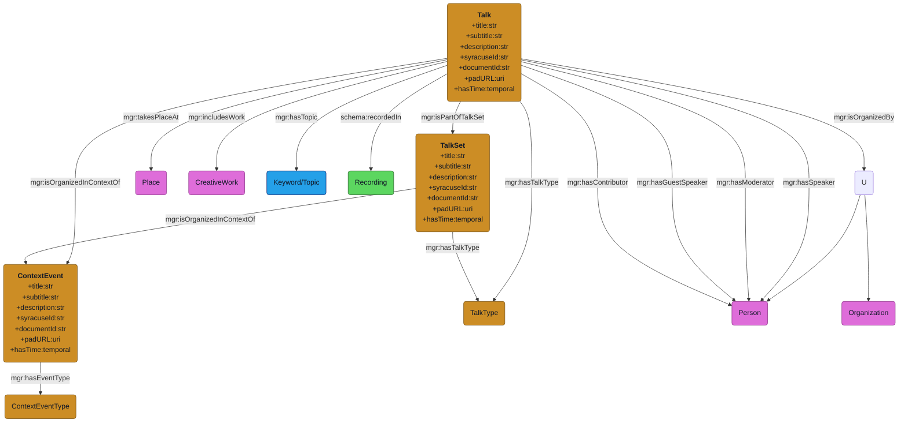

# Talk modules: schema and RDF guidelines

## Schema

```mermaid
flowchart TD

    Talk(<b>Talk</b><br>+title:str<br>+subtitle:str<br>+description:str<br>+syracuseId:str<br>+documentId:str<br>+padURL:uri<br>+hasTime:temporal)
    TalkSet(<b>TalkSet</b><br>+title:str<br>+subtitle:str<br>+description:str<br>+syracuseId:str<br>+documentId:str<br>+padURL:uri<br>+hasTime:temporal)
    ContextEvent(<b>ContextEvent</b><br>+title:str<br>+subtitle:str<br>+description:str<br>+syracuseId:str<br>+documentId:str<br>+padURL:uri<br>+hasTime:temporal)
    ContextEventType(ContextEventType)
    Place(Place)
    TalkType(TalkType)
    Person(Person)
    Organization(Organization)
    CreativeWork(CreativeWork)
    Keyword(Keyword/Topic)
    Recording(Recording)

    U1(U)

    Talk -- mgr:isPartOfTalkSet --> TalkSet
    Talk -- mgr:isOrganizedInContextOf --> ContextEvent
    TalkSet -- mgr:isOrganizedInContextOf --> ContextEvent
    ContextEvent -- mgr:hasEventType --> ContextEventType
    Talk -- mgr:takesPlaceAt --> Place
    Talk -- mgr:hasTalkType --> TalkType
    TalkSet -- mgr:hasTalkType --> TalkType
    Talk -- mgr:isOrganizedBy --> U1
    U1 --> Person
    U1 --> Organization
    Talk -- mgr:hasTopic --> Keyword
    Talk -- mgr:hasSpeaker --> Person
    Talk -- mgr:hasModerator --> Person
    Talk -- mgr:hasGuestSpeaker --> Person
    Talk -- mgr:hasContributor --> Person
    Talk -- mgr:includesWork --> CreativeWork
    Talk -- schema:recordedIn --> Recording

classDef recording fill:#5CD660,stroke:#29592B,color:#111827
class Recording recording
classDef metadata fill:#25A0E8,stroke:#17226E,color:#111827
class Keyword metadata
classDef event fill:#CC8D25,stroke:#755115,color:#111827
class ContextEvent,ContextEventType,Talk,TalkType,TalkSet event
classDef entity fill:#DE6DD9,stroke:#8A3286,color:#111827
class Person,Place,Organization,CreativeWork entity
```