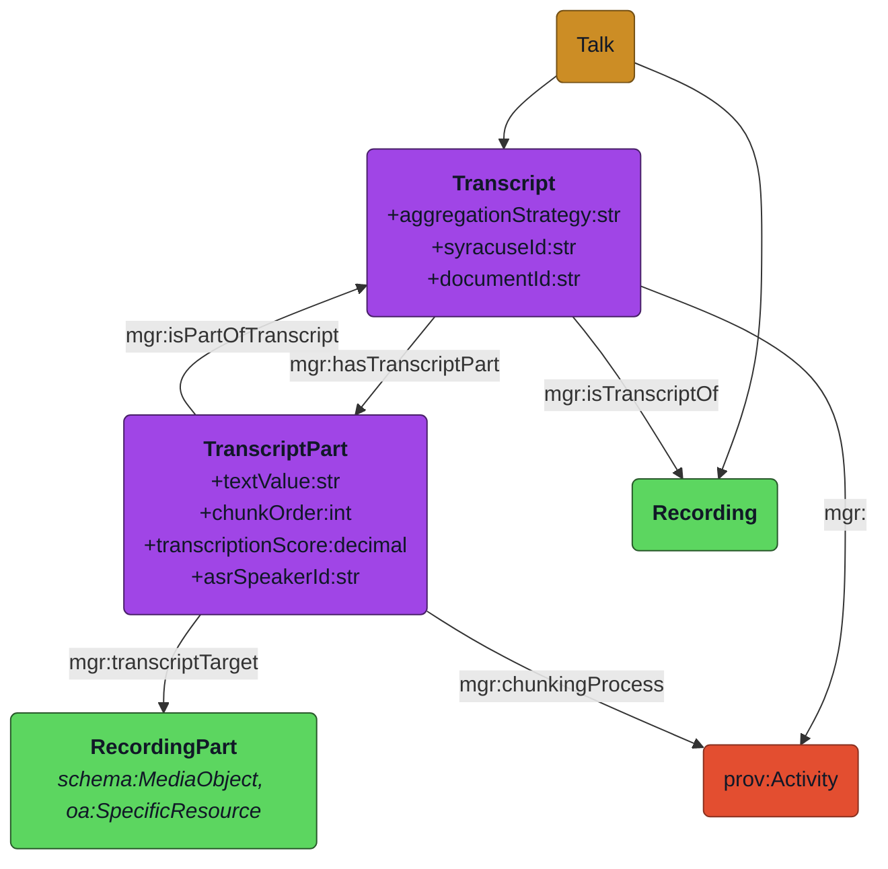

# Transcript module: schema and RDF guidelines
## Schema

```mermaid
flowchart TD

    Transcript(<b>Transcript</b><br>+aggregationStrategy:str<br>+syracuseId:str<br>+documentId:str)
    TranscriptPart(<b>TranscriptPart</b><br>+textValue:str<br>+chunkOrder:int<br>+transcriptionScore:decimal<br>+asrSpeakerId:str)
    
    Talk(Talk)
    Recording(<b>Recording</b>)
    RecordingPart(<b>RecordingPart</b><br><i>schema:MediaObject, oa:SpecificResource</i>)
    Activity(prov:Activity)

    Talk --> Recording
    Talk --> Transcript
    Transcript -- mgr:hasTranscriptPart --> TranscriptPart
    TranscriptPart -- mgr:isPartOfTranscript --> Transcript
    
    Transcript -- mgr:isTranscriptOf --> Recording
    TranscriptPart -- mgr:transcriptTarget --> RecordingPart
    
    Transcript -- mgr: --> Activity
    TranscriptPart -- mgr:chunkingProcess --> Activity

classDef transcript fill:#A045E6,stroke:#492069,color:#111827
class Transcript,TranscriptPart transcript

classDef event fill:#CC8D25,stroke:#755115,color:#111827
class Talk event

classDef recording fill:#5CD660,stroke:#29592B,color:#111827
class Recording,RecordingPart recording

classDef activity fill:#E34E30,stroke:#8A3120,color:#111827
class Activity activity
```