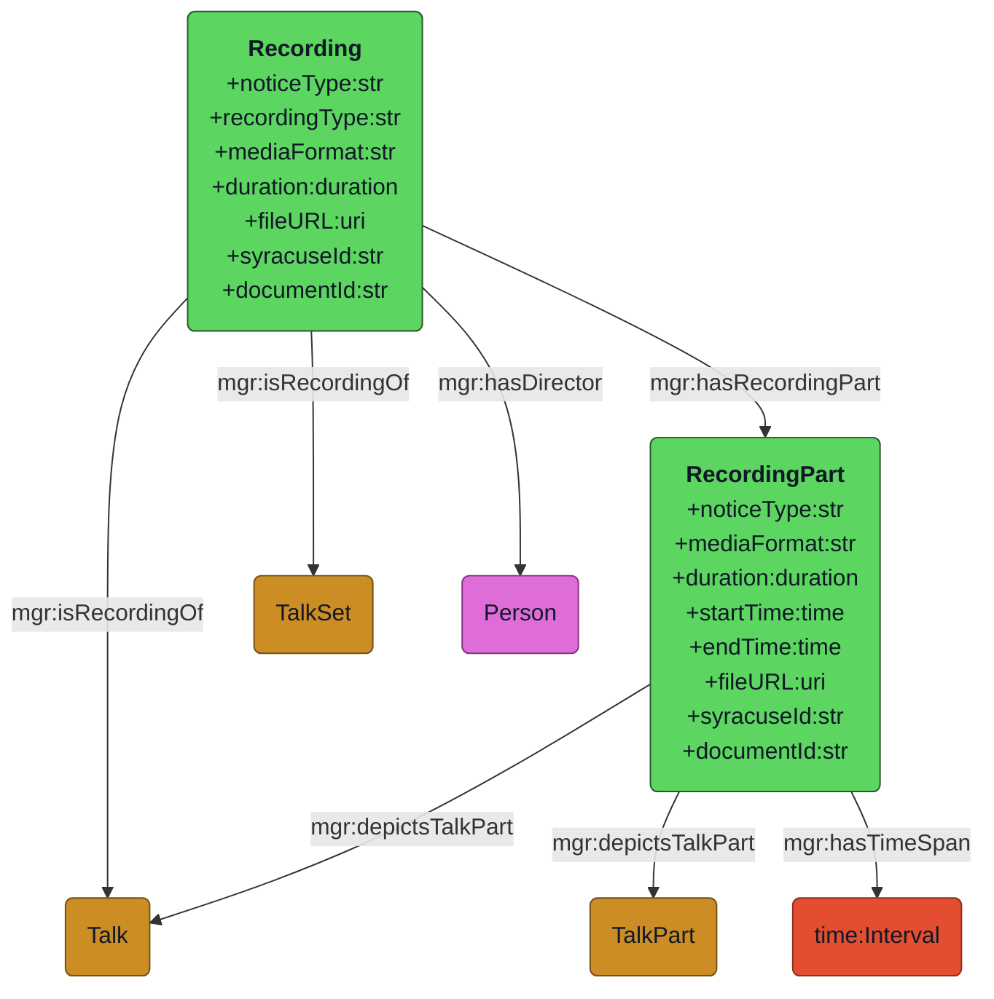

# Recording module: schema and RDF guidelines

## Schema

```mermaid
flowchart TD

    Recording(<b>Recording</b><br>+noticeType:str<br>+recordingType:str<br>+mediaFormat:str<br>+duration:duration<br>+fileURL:uri<br>+syracuseId:str<br>+documentId:str)
    RecordingPart(<b>RecordingPart</b><br>+noticeType:str<br>+mediaFormat:str<br>+duration:duration<br>+startTime:time<br>+endTime:time<br>+fileURL:uri<br>+syracuseId:str<br>+documentId:str)
    TalkSet(TalkSet)
    Talk(Talk)
    TalkPart(TalkPart)
    Person(Person)
    TimeInterval(time:Interval)

    Recording -- mgr:isRecordingOf --> TalkSet
    Recording -- mgr:isRecordingOf --> Talk

    Recording -- mgr:hasRecordingPart --> RecordingPart
    
    RecordingPart -- mgr:depictsTalkPart --> Talk
    RecordingPart -- mgr:depictsTalkPart --> TalkPart
     
    Recording -- mgr:hasDirector --> Person
    RecordingPart -- mgr:hasTimeSpan --> TimeInterval

classDef recording fill:#5CD660,stroke:#29592B,color:#111827
class Recording,RecordingPart recording
classDef event fill:#CC8D25,stroke:#755115,color:#111827
class TalkSet,Talk,TalkPart event
classDef entity fill:#DE6DD9,stroke:#8A3286,color:#111827
class Person entity
classDef structure fill:#E34E30,stroke:#8A3120,color:#111827
class TimeInterval structure
```